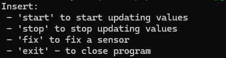

## Introduction
One of the applications of drones (Unmanned Aerial Vehicles) is last-mile package delivery.
In last years the number of commercial drone delivery has started to grow, and current activity involves more than just test flights.
Drone technology has the potential to meet a range of last-mile consumer use cases, such as prepared food, convenience products, and other small packages, as well as B2B needs, such as moving medical samples to labs.
Under certain conditions - such as in regions with poor road infrastructure or when pooling deliveries does not make sense - drones may already be the most cost-effective mode of delivery. They are also environmentally friendly, with CO2 emissions typically lower than those of electric cars and vans making a single delivery, and significantly lower than those of gasoline-powered vehicles.  

Drones have to choose the best path for the delivery in order to reduce energy consumption and time to deliver.
To do so, one of the factors to take in consideration is wind. Infact going in opposite direction to the wind causes the drones to consume more energy and time.
So the purpose of **WindTracker** is to offer a way to efficiently get data about wind.

## WindTracker
WindTracker offers a way for drones to get updated data about wind in real time, to help them pick the best path to make the delivery.
The idea is that a lot of sensors are deployed in a geographical zone and every sensor stores the data in a database.
This data can be queried live to get the latest sensors states, so drones can choose the best path to get to the destination in order to optimize energy consumption and time to delivery. 
Another option is to use this data to make statistical analysis, about a determined geographical zone in a determined period of the year, to support the decision making process.

The Serverless approach for the infrastructure gives us benefits like minimizing time to market, that is given by the fact that we don't have to manage infrastructure, and obviously it allows us to reduce costs by paying for just what we use.

To sum up WindTracker allows the user to:
- Add wind sensors to the infrastracture
- Handle errors that can occur to the sensors
- Store data about wind to make predictions about wind direction and speed
- Visualize live data about wind through a web application

## Installation
To be able to run **WindTracker** you need to install:
- *Docker*: you can download it from [here](https://www.docker.com/products/docker-desktop/).

### Clone repository to your machine

```
git clone https://github.com/Be-Cenzo/WindTracker 
```

### Start Docker
Open a terminal an in WindTracker folder run:
```
docker-compose up -d --build
```

When all the containers are started you can access the web application at http://localhost.

As the project is composed also of a command-line application that simulates the behaviour of the sensors, you have to access to the container that is running that application, so run this command in a terminal:
```
docker attach terraform-local
```

At this point when you see this menu you can start the simulation by typing 'start'.
